# Exploratory Analysis on Airport using PySpark
This project focuses performing Exploratory Analysis on Flights within US using PySpark which is run on Google Colab Notebook Environment.

**The major steps that the project follows are as follows:**

1. Installing Spark and Initializing PySpark on Google Colab Notebook.
2. Reading the CSV Data File into Spark.
3. Converting the Spark DataFrame to a temporary table that can be used with SparkSQL.
4. Implementing Transfomations and Actions on Spark DataFrame.
5. Implementing SparkSQL using SQLContext Module.

## Data

The data is open source and can be found on kaggle under the title [USA Airport Dataset](https://www.kaggle.com/flashgordon/usa-airport-dataset)

This project uses the dataset that is available at the link as of 31 March, 2021. 

## Installing and Initializing Spark

1. Download JRE Headless version to Notebook.
2. Download Spark with Hadoop installation zip file and unzip it for further use.
3. Set the Javahome and Sparkhome variables.
4. Install and Initialize findspark library.
5. Create Spark and SQLContext Sessions.

The above steps can be found in the [Notebook](https://github.com/ojaashampiholi/Airport_Analysis_PySpark/blob/main/Airport_Analysis_PySpark.ipynb)

## Reading CSV File using Spark

```python
df = spark.read.csv("/content/drive/MyDrive/spark_file/Airports2.csv", header=True, inferSchema=True)
df.registerTempTable('df')
```

## Insights into Data

**The Number of Records in the dataset are**

```python
df.count()
```
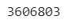

**The Schema for the dataset is as follows**

```python
df.printSchema()
```

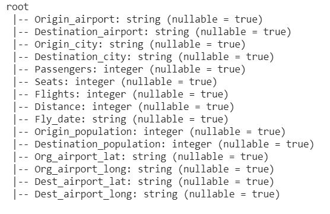

**Various Statistical Analysis Factors for the Features can be seen below**

```python
df.describe().show()
```

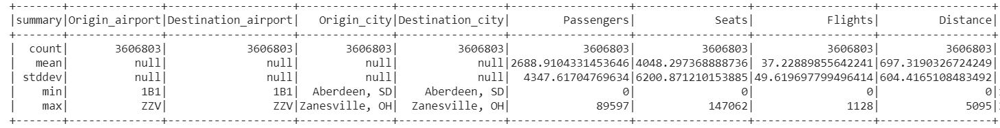

## Spark Transformations and Actions

**Viewing First 5 Rows of Data**

```python
df.show(5)
```
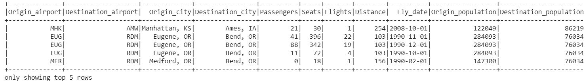

**Selecting Subset of Features**

```python
df.select("Origin_airport","Destination_airport","Passengers","Seats").show(15)
```

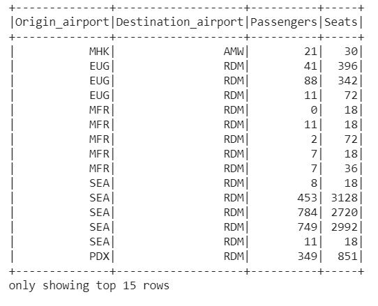

**Aggregating the Data**

```python
airportAgg_DF = df.groupBy("Origin_airport").agg(F.sum("Passengers"))
airportAgg_DF.show(10)
```
 
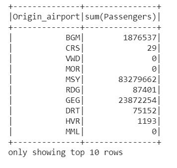

## Spark SQL

**Find the Airport with Highest Number of Flight Departures**
```python
originAirports = sqlContext.sql("""select Origin_Airport, sum(Flights) as Flights 
                                    from df group by Origin_Airport order by sum(Flights) DESC limit 10""")
originAirports.show()
```

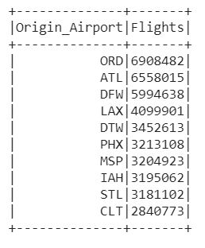

We can see that the most popular airports in terms of flights departures are Chicago O'Hare, Hartsfield-Jackson Atlanta, Dallas/Fort Worth and Los Angeles International Airports in the same order.

**Find the Airport with Highest Number of Passenger Arrivals**

```python
destinationAirports = sqlContext.sql("""select Destination_airport, sum(Passengers) as Passengers 
                                    from df group by Destination_airport order by sum(Passengers) DESC limit 10""")
destinationAirports.show()
```

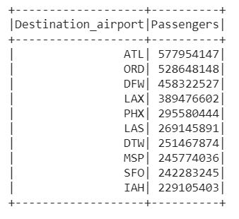

We can see that the most popular airports in terms of passenger arrivals are Hartsfield-Jackson Atlanta, Chicago O'Hare, Dallas/Fort Worth and Los Angeles International Airports in the same order.

**Find the Airport with Most Flight Traffic**

```python
MostFlightsByAirports = sqlContext.sql("""with destination as (select Destination_airport as Airport, sum(Flights) as Out_Flights 
                                    from df group by Destination_airport),
                                    origin as (select Origin_airport as Airport, sum(Flights) as In_Flights 
                                    from df group by Origin_airport)
                                    select origin.Airport, (destination.Out_Flights+origin.In_Flights) as Total_Flights
                                    from origin, destination 
                                    where origin.Airport = destination.Airport
                                    order by (origin.In_Flights + destination.Out_Flights) DESC
                                    limit 15""")
MostFlightsByAirports.show()
```

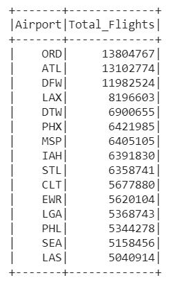

We can see that the most popular airports in terms of Number of Flights are Chicago O'Hare, Hartsfield-Jackson Atlanta, Dallas/Fort Worth and Los Angeles International Airports in the same order.

**Find the Airport with Most Passenger Footfall**

```python
MostPassengersByAirports = sqlContext.sql("""with destination as (select Destination_airport as Airport, sum(Passengers*Flights) as Out_Passengers 
                                    from df group by Destination_airport),
                                    origin as (select Origin_airport as Airport, sum(Passengers) as In_Passengers
                                    from df group by Origin_airport)
                                    select origin.Airport, (destination.Out_Passengers+origin.In_Passengers) as Total_Passengers
                                    from origin, destination 
                                    where origin.Airport = destination.Airport
                                    order by (origin.In_Passengers + destination.Out_Passengers) DESC
                                    limit 15""")
MostPassengersByAirports.show()
```

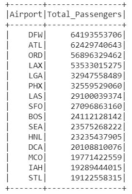

We can see that the most popular airports in terms of Number of Passengers are Dallas/Fort Worth, Hartsfield-Jackson Atlanta, Chicago O'Hare and Los Angeles International Airports in the same order.

**Find the Occupancy Rate for Most Popular Routes**

```python
distanceQuery = sqlContext.sql("""with table1 as 
                                    (select least(Origin_airport, Destination_airport) as Airport1, 
                                    greatest(Destination_airport, Origin_airport) as Airport2, 
                                    sum(Flights) as Flights,
                                    sum(Passengers) as Passengers,
                                    sum(Seats) as Seats
                                    from df
                                    group by least(Origin_airport, Destination_airport), greatest(Destination_airport, Origin_airport)
                                    order by 1,2)
                                    select t.*, (Passengers*100/Seats) as Occupancy_Rate
                                    from table1 t
                                    order by Flights DESC, Seats DESC, Passengers DESC, Occupancy_Rate DESC
                                    limit 15;""")
distanceQuery = distanceQuery.filter((col("Occupancy_Rate").isNotNull()) & (col("Occupancy_Rate")<=100.0))
distanceQuery.show(15)
```

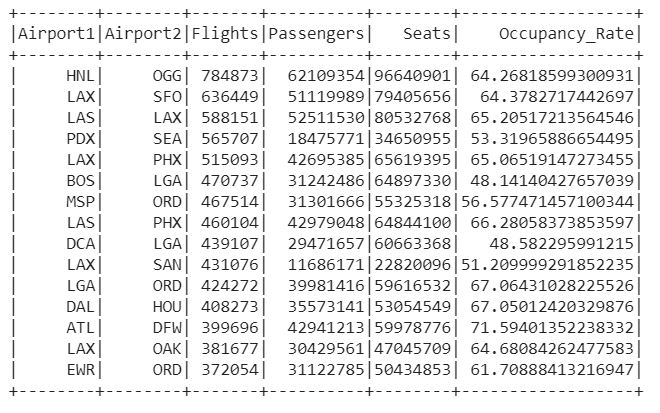

The occupancy rates of the most popular flights is somewhere between 48% and 71% with an average of 60%. This implies that although there are lots of flights that operate between the airports, most of them are not efficient in terms of passenger traffic. Also, reducing and rescheduling some flights to increase occupancy rates can help the Airlines to reduce their fuel costs, while also helping to protect environment by reducing carbon footprint.

**Find the Number of Flights for Long Distance Journeys**

```python
distanceQuery = sqlContext.sql("""with table1 as 
                                    (select least(Origin_airport, Destination_airport) as Airport1, 
                                    greatest(Destination_airport, Origin_airport) as Airport2, 
                                    mean(Distance) as Distance,
                                    sum(Flights) as Flights
                                    from df
                                    group by least(Origin_airport, Destination_airport), greatest(Destination_airport, Origin_airport)
                                    order by 1,2)
                                    select t.*
                                    from table1 t
                                    where Flights>0
                                    order by Distance DESC
                                    limit 15;""")
distanceQuery.show(15)
```

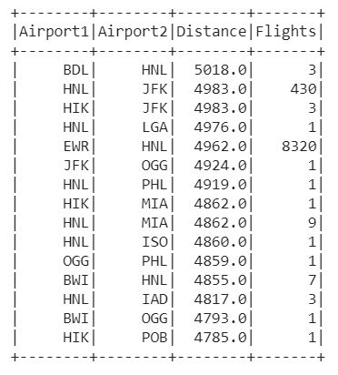

We can observe from the table that in most of the cases, the frequency of long distance flights is low. However, it is interesting to note that there are lots of flights that operate between Hawaii - Honolulu (Honolulu International Airport) and New York (John F Kennedy Intenational Airport and Newark Liberty Intenational Airport) even with considerable long distance between the two places.

**Find the Average Distances for the Routes with Most Flights**

```python
distanceQuery = sqlContext.sql("""with table1 as 
                                    (select least(Origin_airport, Destination_airport) as Airport1, 
                                    greatest(Destination_airport, Origin_airport) as Airport2, 
                                    mean(Distance) as Distance,
                                    sum(Flights) as Flights
                                    from df
                                    group by least(Origin_airport, Destination_airport), greatest(Destination_airport, Origin_airport)
                                    order by 1,2)
                                    select t.*
                                    from table1 t
                                    where Flights>0
                                    order by Flights DESC
                                    limit 15;""")
distanceQuery.show(15)
```

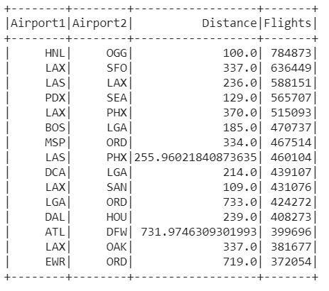

We can see that medium distance routes (100-300 miles) have the most number of flights except for few exception cases. Flight Route between Chicago (ORD) and New York (EWR, LGA) is operated heavily even thought the distance between airports is 725 miles. Another interesting case that we see here is that flight between Atlanta (ATL) and Dallas/Fort Worth (DFW) is popular service even though the distance is around 720 miles.
